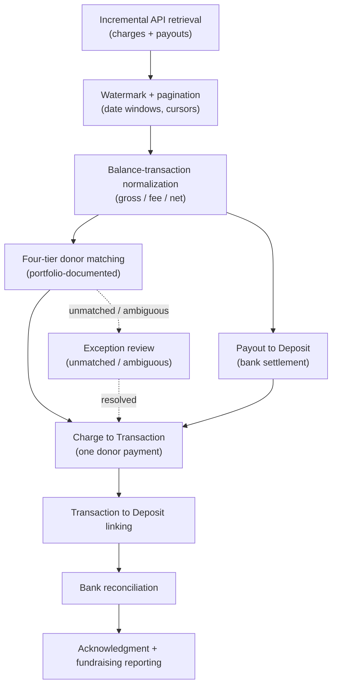

# Development-Finance Lifecycle

A diagram of the Stripe → Dataverse reconciliation workflow: from API retrieval
through donor matching, deposit and transaction creation, linking, and
reconciliation.

> **Evidence tier:** Reconstructed. The stages are a sanitized reconstruction of
> the production workflow from surviving technical notes and source structure.
> Headline figures (483+ records, 89.7% match rate, four-tier matching) are
> **portfolio-documented**, not audited here; the exact tier order, thresholds,
> query filters, and 89.7% numerator/denominator are **not preserved**.

## The lifecycle

## Stage reference

| Stage | What happens | Evidence |
|---|---|---|
| Incremental API retrieval | Pull new charges and payouts from Stripe | Reconstructed |
| Watermark + pagination | Retrieve only newer records; page through results | Reconstructed |
| Balance-transaction normalization | Read gross/fee/net from the expanded charge | Corroborated (74-charge sample) |
| Four-tier donor matching | Resolve payment to a Contact; route exceptions | Portfolio-documented (order not preserved) |
| Payout → Deposit | Create/find the Deposit for a payout | Reconstructed |
| Charge → Transaction | Create the Transaction for a charge | Reconstructed |
| Transaction ↔ Deposit linking | Bind each Transaction to its Deposit | Reconstructed |
| Exception review | Hold unmatched/ambiguous records for review | Reconstructed |
| Bank reconciliation | Compare settlement, deposit, and CRM records | Reconstructed |
| Acknowledgment + reporting | Feed stewardship and fundraising reports | Reconstructed |

## Object distinction

Charges, balance transactions, payouts, bank deposits, and Dataverse
Transactions are kept distinct throughout: **payouts become Deposits**, **charges
become Transactions**, and the **balance transaction** supplies the money math.
The surviving sample is **74 charge objects** — a separate export, not the
complete migration population and not a known subset of the 483+ total.

Full detail:
[`../development-finance/reconciliation-lifecycle.md`](../development-finance/reconciliation-lifecycle.md).
