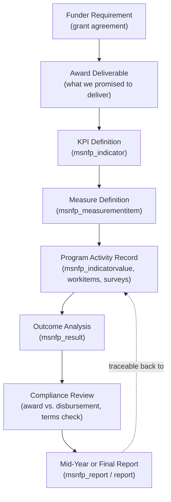

# Grant Reporting Lifecycle

A diagram of how a single funder requirement travels all the way to a submitted,
audit-ready report. Written for grant-development and nonprofit-operations
readers: it shows the flow, not every table.

> **Evidence tier:** Reconstructed. The stages and the entities named are
> **verified** as present in the Tracking area; the end-to-end flow is a
> structural reconstruction. The grant measurement **design counts** (9 KPI
> targets, 19 supporting items, 20 curated measures, 23 proposal objectives) are
> **verified** from grant sources; deployed Dataverse indicator/measure record
> counts remain **pending verification.**

## The Lifecycle

## Stage Reference

| Stage | Entity/entities | What happens |
|---|---|---|
| Funder Requirement | `msnfp_award`, `account` | Grant terms captured |
| Award Deliverable | `msnfp_objective`, `msnfp_deliveryframework`, `msnfp_programitem` | Requirements become deliverables |
| KPI Definition | `msnfp_indicator` | Each deliverable gets a KPI |
| Measure Definition | `msnfp_measurementitem` | Each KPI gets a concrete measure |
| Program Activity Record | `msnfp_indicatorvalue`, `msnfp_workitem`, `tr_*surveys` | Live records accumulate |
| Outcome Analysis | `msnfp_result`, `msnfp_assessment` | Records analyzed into outcomes |
| Compliance Review | `msnfp_award` ↔ `msnfp_disbursement` ↔ `msnfp_item` | Outcomes + spend reconciled |
| Mid-Year / Final Report | `msnfp_report`, `report`, `tr_adminreporting`, `tr_counselingreporting` | Report assembled and submitted |

## Why the Dotted Line Matters

The dotted "traceable back to" arrow is the whole point of an audit-ready
system: any number in a submitted report can be traced back to the program
activity records that produced it. Full detail in
[`../grants-outcomes/grant-lifecycle.md`](../grants-outcomes/grant-lifecycle.md).

## Verified Grant Counts

- The grant measurement matrix defined **9 headline KPI targets** and **19
  supporting measurement and implementation items** across case management and
  counseling. A curated reporting framework translated that work into **20
  tracked measures**. The related 2026 proposal identified **23 measurable
  objectives** and established interim and final reporting requirements. These
  figures count different things and are **not** additive.

## Pending Verification

- The count of `msnfp_indicator` and `msnfp_measurementitem` **records deployed
  in Dataverse** is **not** confirmed by any available source. The verified
  figures above describe the measurement *design*, not live record totals.
