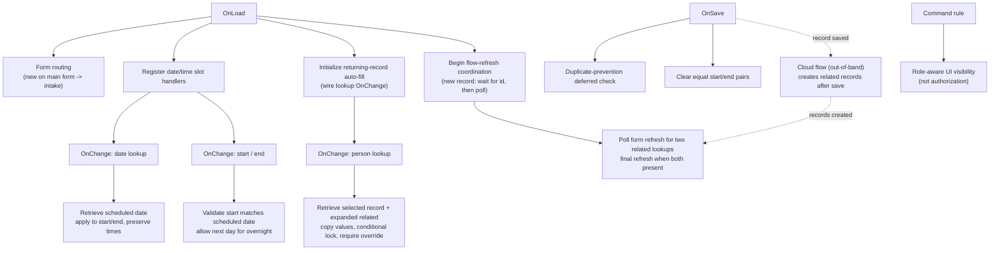

# Model-Driven Web Resource Lifecycle

Where the six documented client-side patterns attach to a model-driven Power Apps
form's event lifecycle. All names are invented reconstructions; no production
script, schema, or identifier is shown.

> **Evidence tier:** Reconstructed. A generalized rendering of the standard
> model-driven form event model, aligned to the reviewed source techniques.

## Form event lifecycle

## Event-to-pattern map

| Event | Pattern | Behavior | Async? |
|---|---|---|---|
| OnLoad | Form routing | Redirect a new record on the main form to the intake form | No |
| OnLoad | Date/time validation | Register per-slot OnChange handlers | No |
| OnLoad | Returning-record auto-fill | Wire the lookup's OnChange | No |
| OnLoad | Flow-refresh coordination | New record: bounded wait for id, then poll | Yes |
| OnChange (person lookup) | Returning-record auto-fill | Retrieve selected record + expanded related; copy values; conditional lock; require override | Yes |
| OnChange (date lookup) | Date/time validation | Retrieve scheduled date; apply to start/end preserving times | Yes |
| OnChange (start / end) | Date/time validation | Validate scheduled-date alignment; allow next day for overnight | Yes |
| OnSave | Duplicate prevention | Deferred async existence check for the parent | Yes |
| OnSave | Date/time validation | Clear equal start/end pairs | No |
| Command rule | Command security | Role-aware visibility — **not** authorization | No |

## The cloud flow is out-of-band

The Power Automate cloud flow is **not** triggered by this JavaScript. It runs
out-of-band and creates the two related records **after the primary record is
saved**. The OnLoad flow-refresh coordination waits for the new record to receive
an id, then polls form-data refreshes until both related lookups are present and
does one final refresh.

## Design rules carried across patterns

- Derive `formContext` from the execution context; pass it explicitly.
- Guard on form type so create-only logic never touches existing records.
- Prefer `Xrm.WebApi` (async) with the **table logical name** as the first
  argument; never a synchronous call.
- Defer saves for async validation with a re-entrancy guard.
- Wrap dynamically-registered async handlers in `try/catch` so a failed retrieval
  never escapes as an unhandled rejection.
- Bound every retry/poll; never spin.
- Treat UI command-hiding as UX, **not** authorization — enforce server-side.

Full detail:
[`../web-resources/README.md`](../web-resources/README.md).
