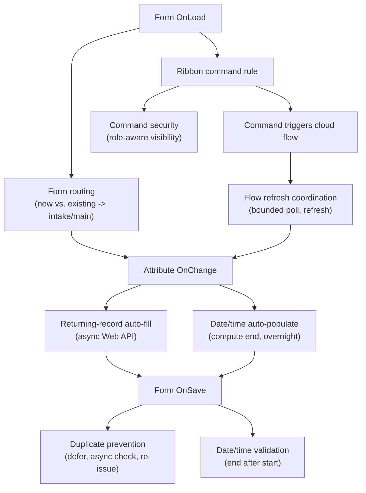

# Model-Driven Web Resource Lifecycle

Where client-side web resources fit in a model-driven Power Apps form's lifecycle,
and how the six documented patterns map onto its events.

> **Evidence tier:** Reconstructed. A generalized rendering of the standard
> model-driven form event model; all pattern names are invented reconstructions.
> No production script, schema, or identifier is shown.

## Form event lifecycle

## Pattern-to-event map

| Event | Pattern | Async? |
|---|---|---|
| OnLoad | Form routing | No |
| OnChange (lookup) | Returning-record auto-fill | Yes (Web API) |
| OnChange (start/duration) | Date/time auto-populate | No |
| OnSave | Duplicate prevention | Yes (deferred save) |
| OnSave | Date/time validation | No |
| Command rule | Command security | No |
| Post-command | Cloud-flow refresh coordination | Yes (bounded poll) |

## Design rules carried across patterns

- Derive `formContext` from the execution context; pass it explicitly.
- Guard on form type so create-only logic never touches existing records.
- Prefer `Xrm.WebApi` (async) over legacy synchronous calls.
- Defer saves for async validation with a re-entrancy guard.
- Bound every retry/poll; never spin.
- Treat UI command-hiding as UX, **not** authorization — enforce server-side.

Full detail:
[`../web-resources/README.md`](../web-resources/README.md).
