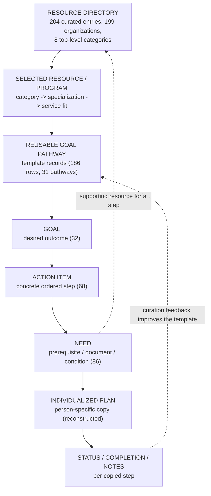

# Service-Navigation Lifecycle

A diagram of how the two service-navigation systems — the resource directory
and the goal pathway — carry a case-management workflow from discovering help
to tracking a person's progress toward it.

> **Evidence tier:** the directory and pathway structures, their field
> concepts, and the resource-to-pathway link are **directly supported** by two
> private production exports (aggregates recomputed 2026-07-15; see
> [`../service-navigation/metrics.md`](../service-navigation/metrics.md)). The
> individualized-plan copy stage is a **sanitized reconstruction** — the
> template design and a copy-target field imply it, but no person-level plan
> data exists in the analyzed evidence. Pathway coverage was **selective**
> (16 of 204 directory resources), not universal.

## The lifecycle

## Stage reference

| Stage | What happens | Evidence |
|---|---|---|
| Resource directory | Curated catalog of organizations, programs, taxonomy, contacts, hours | Directly supported |
| Selected resource / program | Case manager narrows by category, specialization, service description | Directly supported (taxonomy layers) |
| Reusable goal pathway | The template route attached to a resource | Directly supported (165 linked rows, 16 resources) |
| Goal | Outcome broad enough to orient, specific enough to act on | Directly supported (32 rows) |
| Action Item | Ordered concrete step; may be optional or phased | Directly supported (68 rows) |
| Need | Prerequisite required before the step completes | Directly supported (86 rows) |
| Individualized plan | Hierarchy copied per person, template preserved | Reconstructed |
| Status / completion / notes | Per-step progress on the copy only | Reconstructed |

## The two systems solve different problems

The directory answers *where help exists*; the pathway answers *how to reach
it*. The link between them is what turns a lookup tool into a navigation
system: discovery hands off to an actionable, prerequisite-aware sequence.

Full detail:
[`../service-navigation/linkage-model.md`](../service-navigation/linkage-model.md).
