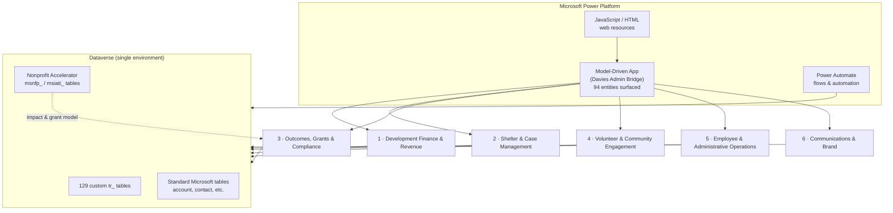

# System Overview

A recruiter-friendly view of how the six operational areas connect through one
Dataverse environment and the Power Platform. This intentionally hides
individual tables — see [`../dataverse/application-sitemap.md`](../dataverse/application-sitemap.md)
for the full entity map.

> **Evidence tier:** Reconstructed. The six areas, the single-environment
> design, and the platform components are **verified**; the diagram is a
> simplified original rendering.

## The Environment at a Glance

## How to Read It

- **One environment, six areas.** All six operational areas share a single
  Dataverse environment, so data flows between them without integration glue.
- **The app is the front door.** The **Davies Admin Bridge** model-driven app
  surfaces **94 entities** organized into the six areas.
- **Three table families.** Custom `tr_` tables (129) carry the organization's
  unique logic; Nonprofit Accelerator tables provide the impact and grant
  model; standard Microsoft tables provide the CRM/ERP foundation.
- **Automation and UI.** Power Automate flows drive background processing;
  JavaScript/HTML web resources extend the app UI.

## The Six Areas

| # | Area | Focus |
|---|---|---|
| 1 | Development Finance & Revenue | Income/expenses, budgeting, donors, payment reconciliation |
| 2 | Shelter & Case Management | Intake, beds/rooms, case meetings, phases, goals, discharge |
| 3 | Outcomes, Grants & Compliance | Impact measurement, grant KPIs, compliance reporting |
| 4 | Volunteer & Community Engagement | Volunteers, attendance, engagement, groups |
| 5 | Employee & Administrative Operations | Employees, payroll, time tracking, scheduling |
| 6 | Communications & Brand | Documents, templates, surveys, communications |

## Verified Metrics in This Diagram

- 129 custom `tr_` tables — verified (see
  [`../dataverse/inventory-summary.md`](../dataverse/inventory-summary.md)).
- 94 entities surfaced in the model-driven app — verified (see
  [`../dataverse/application-sitemap.md`](../dataverse/application-sitemap.md)).
- 6 operational areas — verified.
