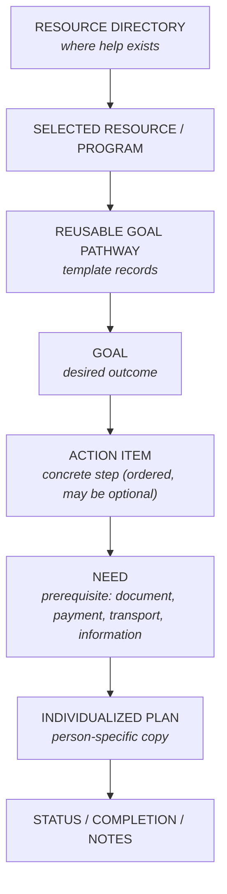

# Linkage Model — from Discovery to Action

**Evidence tier:** the resource-to-pathway link is **directly supported**
(165 of 186 pathway rows carry a resource reference; a deterministic join
matches each of the 16 distinct reference values to exactly one directory
row). The individualized-plan copy flow is also **directly supported**: a
recovered production client script copied a reusable Goal template — with its
child Action Items and Needs — into person-specific records, preserving parent
references, checking for duplicates, and binding the copies to a
person-specific case context. The public entity names, status vocabulary,
diagrams, and the fictional plan example remain **sanitized reconstruction**;
the production schema, form logic, identifiers, option-set values,
notification text, and exact field mappings are **withheld**.

## The full navigation flow

Reading top to bottom: a case manager **discovers** a resource in the
directory, selects the program that fits, follows its **reusable pathway**
template down through Goal → Action Item → Need, then **copies** that
structure into the participant's individualized plan, where progress is
tracked to completion.

## Template records versus person-specific copies

The two record populations look similar but obey opposite rules:

| | Reusable template | Individualized copy |
|---|---|---|
| Represents | The generic route to an outcome | One person's pursuit of it |
| Cardinality | One per outcome | One per person per outcome |
| Contains | Structure, rationale, links, optional flags | All of that **plus** status, dates, person notes |
| Mutation | Curated deliberately, versioned by review | Mutates constantly during casework |
| Privacy class | Organizational knowledge | **Person-specific case data** |

Keeping them separate is what makes the model work:

- **Status never lives on the template.** If it did, two participants pursuing
  the same goal would overwrite each other's progress.
- **Templates stay reusable.** Each copy starts from the current curated
  version; improving the template improves every *future* plan without
  rewriting anyone's history.
- **Privacy boundaries stay clean.** Templates are shareable knowledge; copies
  are case records with entirely different access rules.

## Source-resource linkage: a hybrid reference + snapshot model

The production structure **combined resource references with copied snapshot
fields**. Pathway records carried a reference to the directory resource *and*
their own contact/link fields (phone, website, application, form), and the
recovered copy workflow carried both the reference and those field values onto
the person-specific records. Snapshot fields preserve the information that was
available when the pathway was authored and when a plan was created; copied
values may become stale unless refreshed from the directory.

The link appears at two grains in the source structure:

- **Pathway-level:** the Goal links to the resource the pathway pursues
  (30 of 32 source Goals carry the link).
- **Step-level:** an Action Item or Need may link to a *different* supporting
  resource (a documentation office needed for one step of a mobility-program
  pathway).

### Reference vs. snapshot: the tradeoff

| | Reference-only | Snapshot |
|---|---|---|
| Maintenance | Centrally maintained; correct once, current everywhere it is *dereferenced* | Each copy holds its own values |
| Currency | Always current when dereferenced | May become stale unless refreshed |
| History | No record of what the person was actually told | Preserves the context available when the plan was created |
| Resilience | Depends on the source record remaining available | Usable even if the directory entry changes or is retired |

A **reference-only** design, or a **reference plus explicit snapshot**
design (where snapshot fields are labeled with the date they were captured),
is a *public design recommendation* — it is **not** a claim about the original
production model, which duplicated selected values without an explicit
snapshot marker.

## Preserving hierarchy in the copy

The recovered production workflow demonstrates the core mechanics: it created
the person-specific Goal first, then each child Action Item bound to the *new*
Goal, then each child Need bound to the *new* Action Item — so the copied tree
references its own records, not the template's. It copied the hierarchy code
and selected fields onto every new record, checked for an existing copy in the
person's case context before creating one (confirmation prompt on a
duplicate), and guarded against repeated execution.

Design guidance layered on that evidence (recommendation, not production
claim):

1. Copy the Goal, Action Items, and Needs as **separate records**, keeping
   `step_type`, `step_code`, and parent references intact (demonstrated).
2. Stamp every copied record with an explicit `copied_from` reference back to
   its template record. The production workflow carried the template's
   *hierarchy code* onto the copies (and used it for duplicate detection); an
   explicit lineage reference is the recommended stronger form.
3. Track status **per copied record** — a Need can be complete while its
   Action Item is blocked, and rollups ("2 of 3 needs met") only work if the
   levels stay distinct. (The status vocabulary in this module is a public
   reconstruction; the production status fields are not shown by the
   evidence.)
4. Person-specific additions (an extra Need discovered during casework) are
   inserted with sibling codes on the copy only; the template is untouched
   unless curation deliberately adopts the change.

## Progress tracking

Status lives on the copied records: per-step state (not started / in progress
/ blocked / complete / skipped-optional), completion dates, and free-text case
notes. [`fictional-samples.json`](fictional-samples.json) demonstrates an
individualized copy with fictional status fields.

## Coverage honesty

Linking is **selective, not universal**. 165 of 186 pathway rows contain a
resource reference, representing 16 distinct normalized reference values; a
deterministic cross-workbook join (documented and tested — see
[`metrics.md`](metrics.md)) matches each of the 16 to exactly one of the 204
directory rows, with 0 ambiguous and 0 unmatched references. Pathways
therefore covered **16 of the 204 directory entries**, and 21 pathway rows
carry no resource reference at all. That shape is expected: pathways are built
where the route is complex enough to be worth templating. No claim is made
that every resource had a completed pathway. See
[`evidence-and-limitations.md`](evidence-and-limitations.md).
