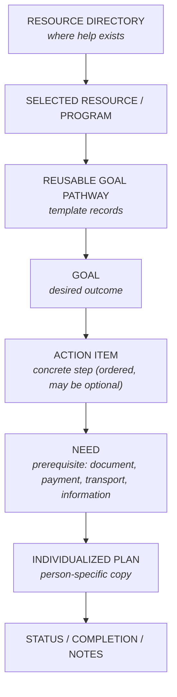

# Linkage Model — from Discovery to Action

**Evidence tier:** the resource-to-pathway link is **directly supported**
(165 of 186 pathway rows reference a directory resource, across 16 distinct
resources). The individualized-plan copy flow is a **sanitized
reconstruction**: the source structure contains a copy-target field
(populated on 1 row) and the template design implies it, but the full
person-plan workflow is not demonstrated by the analyzed exports.

## The full navigation flow

Reading top to bottom: a case manager **discovers** a resource in the
directory, selects the program that fits, follows its **reusable pathway**
template down through Goal → Action Item → Need, then **copies** that
structure into the participant's individualized plan, where progress is
tracked to completion.

## Template records versus person-specific copies

The two record populations look similar but obey opposite rules:

| | Reusable template | Individualized copy |
|---|---|---|
| Represents | The generic route to an outcome | One person's pursuit of it |
| Cardinality | One per outcome | One per person per outcome |
| Contains | Structure, rationale, links, optional flags | All of that **plus** status, dates, person notes |
| Mutation | Curated deliberately, versioned by review | Mutates constantly during casework |
| Privacy class | Organizational knowledge | **Person-specific case data** |

Keeping them separate is what makes the model work:

- **Status never lives on the template.** If it did, two participants pursuing
  the same goal would overwrite each other's progress.
- **Templates stay reusable.** Each copy starts from the current curated
  version; improving the template improves every *future* plan without
  rewriting anyone's history.
- **Privacy boundaries stay clean.** Templates are shareable knowledge; copies
  are case records with entirely different access rules.

## Source-resource linkage

The pathway references the directory rather than duplicating it. A pathway
step that requires calling a provider links to the resource record; it does
not embed the phone number. When the provider's contact changes, the
directory entry is corrected once and every pathway and plan that references
it is current. The link appears at two grains in the source structure:

- **Pathway-level:** the Goal links to the resource the pathway pursues
  (30 of 32 source Goals carry the link).
- **Step-level:** an Action Item or Need may link to a *different* supporting
  resource (a documentation office needed for one step of a mobility-program
  pathway).

## Preserving hierarchy in the copy

Copying a pathway into a plan must preserve the tree, not flatten it:

1. Copy the Goal, Action Items, and Needs as **separate records**, keeping
   `step_type`, `step_code`, and parent references intact.
2. Stamp every copied record with the same plan/person reference and a
   `copied_from` reference back to its template record.
3. Track status **per copied record** — a Need can be complete while its
   Action Item is blocked, and rollups ("2 of 3 needs met") only work if the
   levels stay distinct.
4. Person-specific additions (an extra Need discovered during casework) are
   inserted with sibling codes on the copy only; the template is untouched
   unless curation deliberately adopts the change.

## Progress tracking

Status lives on the copied records: per-step state (not started / in progress
/ blocked / complete / skipped-optional), completion dates, and free-text case
notes. [`fictional-samples.json`](fictional-samples.json) demonstrates an
individualized copy with fictional status fields.

## Coverage honesty

Linking is **selective, not universal**. The analyzed exports show 16 distinct
resources with pathway coverage out of 204 directory entries, and 21 pathway
rows with no resource link at all. That shape is expected: pathways are built
where the route is complex enough to be worth templating. No claim is made
that every resource had a completed pathway. See
[`evidence-and-limitations.md`](evidence-and-limitations.md).
